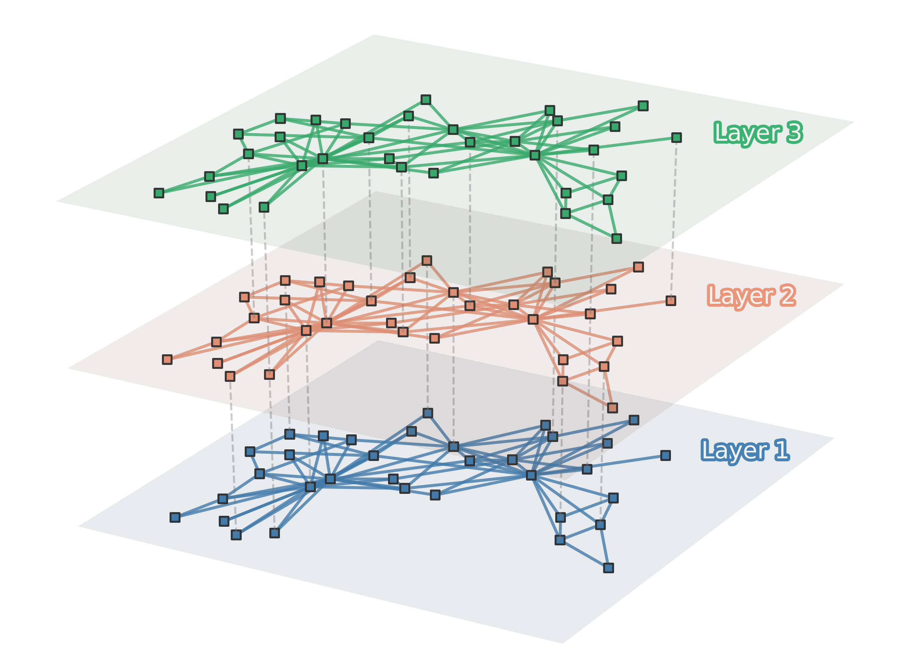

# matplotlib-multilayer-network
Teeny little snippet of template code to create a multilayer network. Another one for the "things you'll probably never need and are not nice enough to *actually* use..." list.

One notebook:
1. [One main code block](https://nbviewer.jupyter.org/github/jkbren/networkx-edge-bundling/blob/master/code/edge-bundling-function.ipynb)

